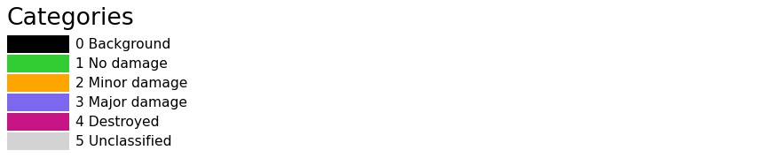
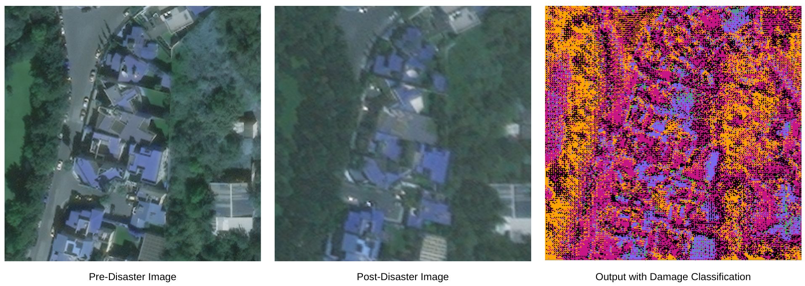

# Disaster Damage Assessment using Satellite Imagery- xView2 Challenge

## The Challenge

The time it takes to properly assess damage in the wake of a major event can be the difference between life and death. However, emergency responders must often navigate disruptions to local communication and transportation infrastructure, making accurate assessments dangerous, difficult, and slow. While satellite and aerial imagery offer a less risky alternative that covers more ground, analysts must still conduct manual, time-intensive assessments of images. 

## Our Approach

We implemented a Siamese-based approach for semantic segmentation tasks focused on assessing building damage levels in pre- and post-disaster imagery. The core of the model architecture is based on UNet, with shared parameters between the upper and lower arms of the network for instance segmentation.

## Data Source

We used [xBD dataset](https://xview2.org/), a publicly available dataset, to train and evaluate our proposed network performance. Detailed information about this dataset is provided in ["xBD: A Dataset for Assessing Building Damage from Satellite Imagery"](https://arxiv.org/abs/1911.09296) by Ritwik Gupta et al.

## Output

## References

[On the Deployment of Post-Disaster Building Damage Assessment Tools using Satellite Imagery: A Deep Learning Approach](https://www.microsoft.com/en-us/research/uploads/prod/2022/11/Damage_Assessment_using_Deep_Learning__ICDM-1.pdf) by Shahrzad Gholami et al.
